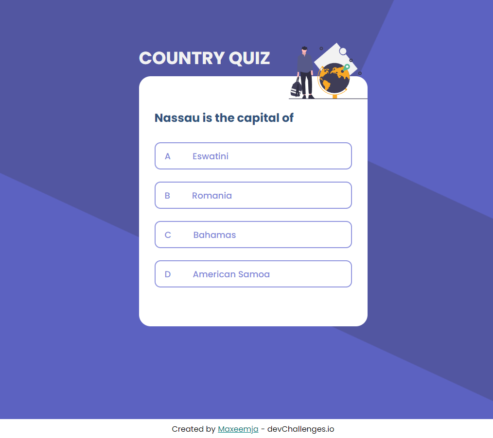

<h1 align="center">WindBnB alike app</h1>

   Solution for a challenge from <a href="http://devchallenges.io" target="_blank">Devchallenges.io</a>.

  <h3>
    <a href="https://maxeemja.github.io/country-quiz">
      Demo
    </a>
     | 
    <a href="https://devchallenges.io/challenges/Bu3G2irnaXmfwQ8sZkw8">
      Challenge
    </a>
  </h3>

<!-- TABLE OF CONTENTS -->
- [Overview](#overview)
    - [Built With](#built-with)
- [Features](#features)

## Overview

- 6th Dev Challenges project
### Built With

- HTML 5
- SCSS 
- JS/React

## Features
- A little quiz which can test your knowledge of capitals and flags.

